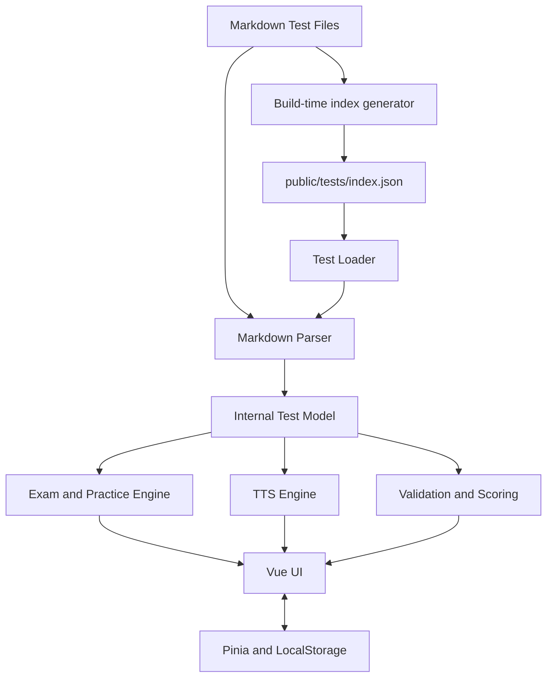
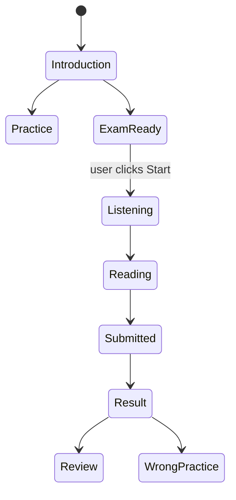
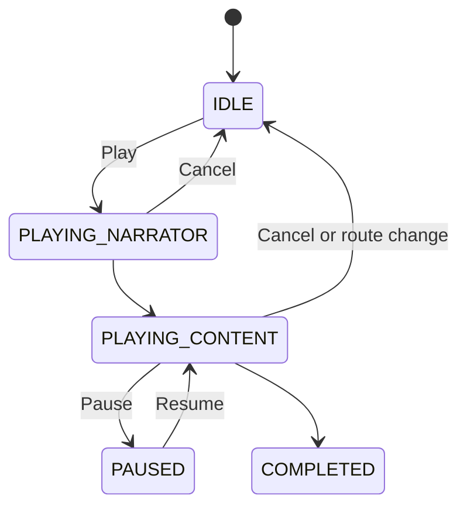

# Architecture

## 总览

## 层与依赖方向

1. **Content Layer**：`public/tests/` 中的 Markdown 和可选图片。只表达内容，不引用 Vue、Pinia 或浏览器 API。
2. **Parser Layer**：`markdownParser.ts` 把受控 heading/section 结构解析为强类型模型，错误包含行号。`testLoader.ts` 只处理 fetch 和组合。
3. **Internal Model**：`types/exam.ts` 是内容与应用之间的唯一契约。Question 同时携带其 group 的 speech/passages，使 Review 无需重新了解 Markdown 层级。
4. **Exam Engine**：Pinia store 保存答案和已提交结果；Practice/Exam view 只负责导航规则。
5. **TTS Engine**：统一拥有 speech synthesis 队列、取消 generation、pause/resume 和角色映射。Vue 组件不能直接构造 utterance。
6. **UI Layer**：组件只接收内部模型。Markdown 通过禁用原始 HTML 的 markdown-it 渲染。
7. **Storage Layer**：仅保存普通 JSON；题库仍来自 Repository，而不是 LocalStorage。

## 页面与状态流

## GitHub Pages 路径策略

`base: './'` 让静态资源相对当前 Pages repository 根目录加载；hash history 让 `/test/...` 存在于 `#` 之后，Pages 服务器无需 SPA fallback。题库 `path` 也是相对路径，并通过 `import.meta.env.BASE_URL` 解析。

## 安全与可靠性边界

- Markdown renderer 禁止 raw HTML，降低 repository 内容造成 DOM 注入的风险。
- Parser 失败被 store 捕获，UI 显示统一错误，完整信息写入 console。
- Validation 的 warning 不阻止 demo；结构性 parser error 会阻止该测试加载。
- 新 TTS 序列会先取消旧序列，并通过 generation token 阻止旧 async loop 继续。
- 官方题量校验只在 `demo: false` 时启用；题号、答案和 choice 校验始终启用。
